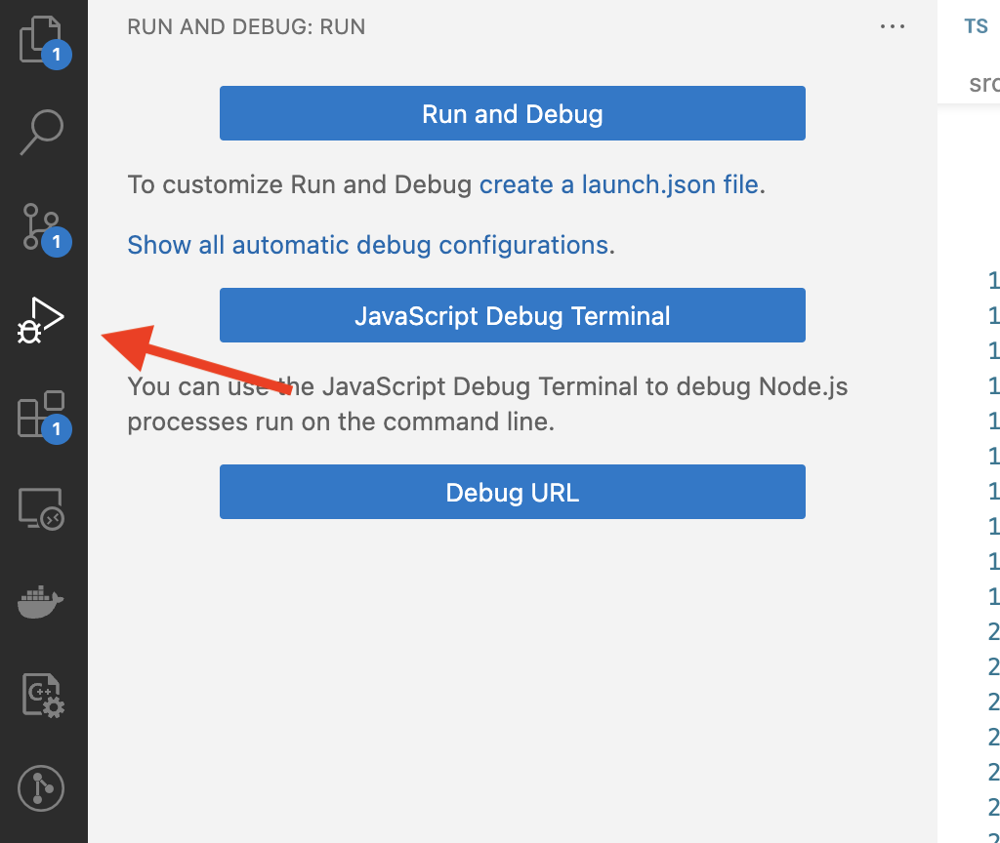
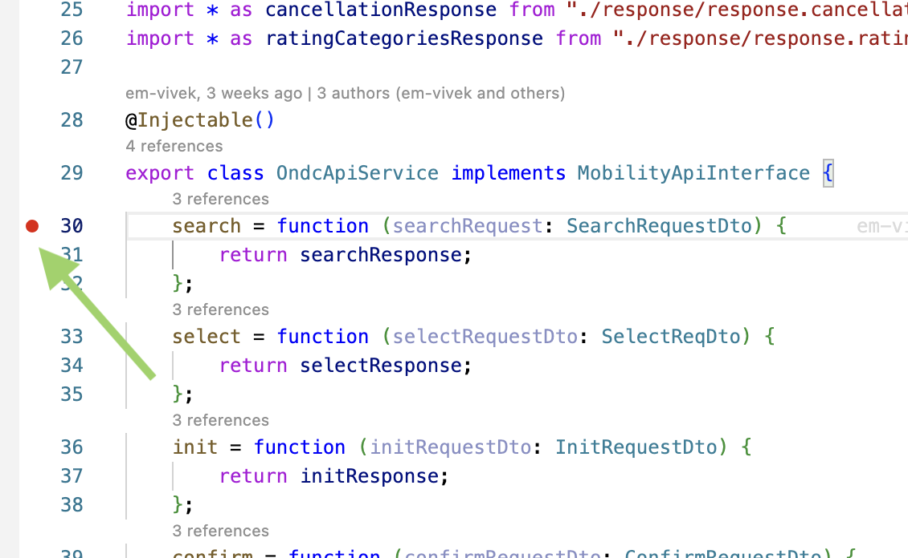

# Troubleshoot Guide

## FAQ

1. When response has empty `responses` array as shown below

```json
{
    "context": {
        "domain": "mobility:ridehailing:0.8.0",
        "core_version": "0.9.4",
        "action": "search",
        "bap_id": "beckn-sandbox-bap.becknprotocol.io",
        "bap_uri": "https://sandbox-bap-network.becknprotocol.io",
        "country": "IND",
        "city": "std:080",
        "transaction_id": "7afe44fd-d947-4a0a-81bc-d286784df2c1",
        "message_id": "c914adc0-fd69-4ff0-8456-9ce2dca0cf4d",
        "ttl": "PT10M",
        "timestamp": "2023-06-01T14:11:47.339Z",
        "max_callbacks": 1
    },
    "responses": []
}
```

**Suggested solutions**

***Solution 1.*** Possibly any of the instance (BPP, Webhook, Sandbox API) is not reachable or may not be responding.

***Solution 2.*** `message_id` should not be sent in request body, it is autogenerated. If it is sent in request body,then it may not be validated.

***Solution 3.*** `bap_id`, `bap_uri`, `bpp_id`, `bpp_uri` may be incorrect in request body's context.

## How to debug in vs code

### Run application in debug mode

1. From the sidebar, code to `Run and Debug` as shown in image below.
<br/>
<br/>

<br/>
<br/>

2. Open the terminal using `Javascript Debug Terminal` button. You can find the button in above image.

3. Now run the application in opened terminal using the application normal running command. This will run the application in debug mode.

4. Add the breakpoint as shown in image below
<br/>
<br/>

<br/>
<br/>
