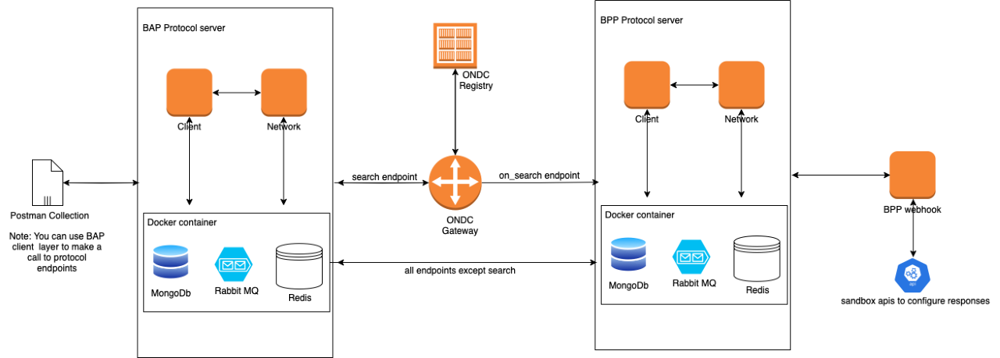
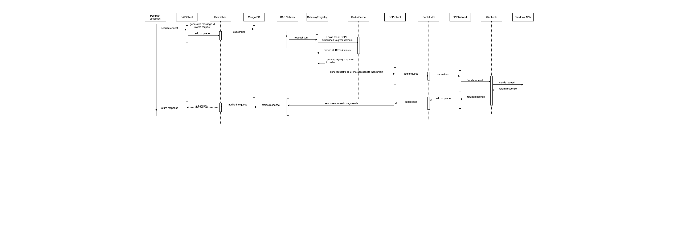
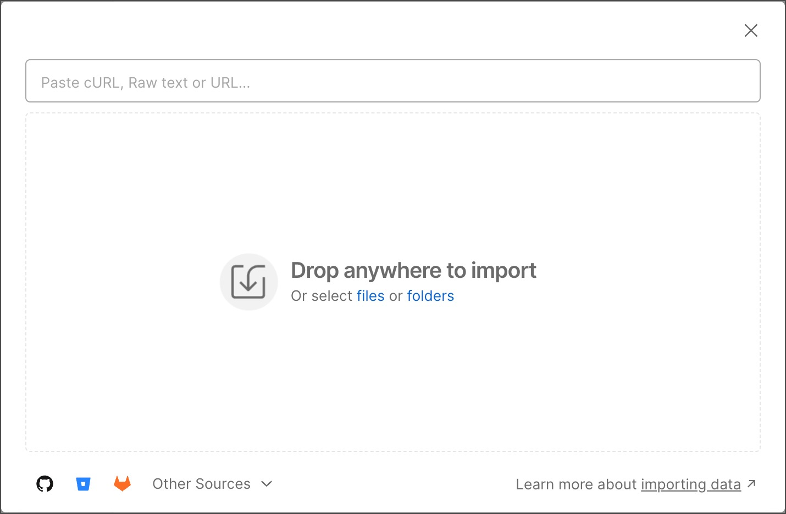
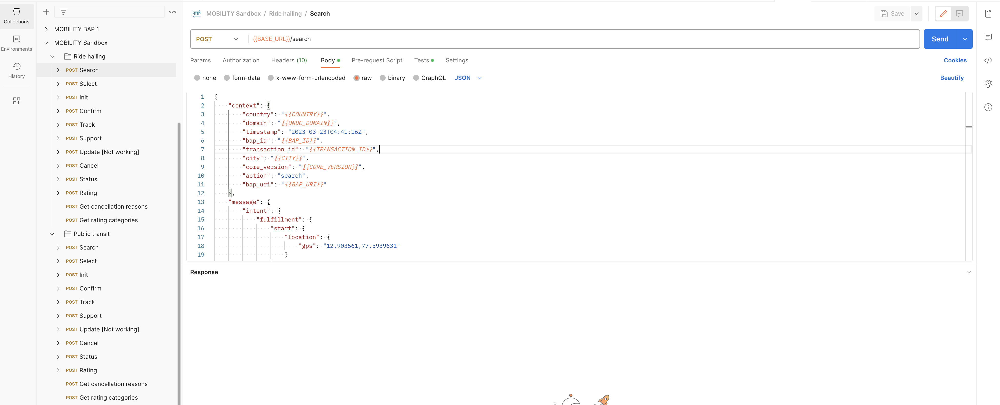
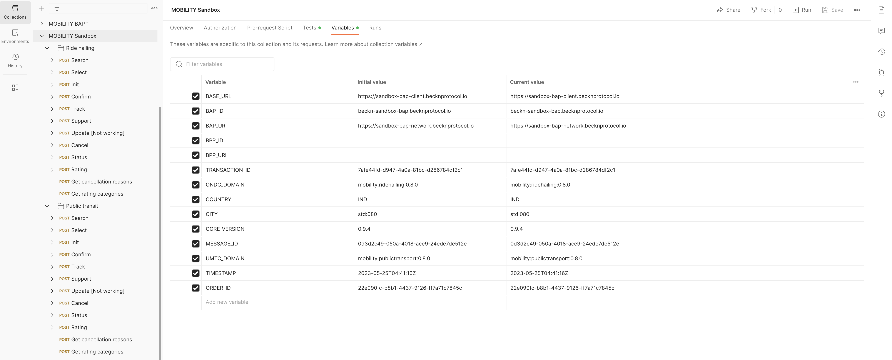

# Sandbox User Guide

Before making the request to sandbox api's, you need to have the [Postman](https://www.postman.com/downloads/) tool. Please follow the further steps to install the postman on specific OS.

## Installing Postman on Mac

Follow the [Install postman on Mac](https://learning.postman.com/docs/getting-started/installation-and-updates/#installing-postman-on-mac) to install postman on Mac

## Installing Postman on Linux

Follow the [Install postman on Linux](https://learning.postman.com/docs/getting-started/installation-and-updates/#installing-postman-on-linux) to install postman on Linux.

## Installing Postman on Windows

Follow instructions at [Install postman on Windows](https://learning.postman.com/docs/getting-started/installation-and-updates/#installing-postman-on-windows) to install postman on windows

Once you are done with the installation process of postman. Please import the collection using below step.

## Sandbox architrcture

Below is the architecture diagram.

Below is the sequence diagram.

## Import Collection in Postman

You can import collections, API specifications, and data files directly into Postman.

To import your data into Postman, select Import in the upper left. The Import modal opens.

You can import your postman collection by by selecting file from local storage. Please download the collection from <https://raw.githubusercontent.com/beckn/beckn-sandbox/feat/readme-file/beckn_sandbox_collection.json>

Once collection is imported successfully, you can view the imported collection with name `MOBILITY Sandbox` in left sidebar's collection list. You will find the two folders having names `Ride hailing` (ONDC) and `Public transit` (UMTC).

## Making request to Sandbox API in Postman

In collection's `Ride hailing` folder, there are list of api request. You can click on any request and hit the `Send` button (shown in image below) to make the request and get the response.

The image shows the requet method as `POST`, url is `{{BASE_URL}}/search` which is endpoint of sandbox search api, `raw` body of type `JSON` which is request body. You can change these to make request modification.

## Collection variable

Yuo have seen url and request JSON body has some variables used (for example: `{{BASE_URL}}, {{COUNTRY}}, {{BAP_ID}}, {{TRANSACTION_ID}}`). These variables are collection level variables. To view the list of variables you can click on collection name `MOBILITY Sandbox` and choose the `variables` tab. Please check the image below.

## Make changes Sandbox API code

### Make changes in request of Sandbox API

To make changes in request, it requires change in request raw JSON body in postman. Along with JSON body changes, there is need to change the sandbox changes in request DTOs. Please find the list of DTO's for `Ride hailing (ONDC)` at `src/ondc/dto` and for `Public transit (UMTC)` at `src/umtc/dto`. Filename in the list as per the request action. For example, for search request, DTO file is `src/ondc/dto/search-request.dto.ts`.

### Make changes in response of Sandbox API

The response is mocked in codebase. The mocked JSON files are separated in codebase and list of JSON files can be viewed at `src/ondc/response` for ONDC and `src/umtc/response` for UMTC folder. For example, in search response you can make changes in file `src/ondc/response/response.search.json` and this will reflect in sandbox search api response.
